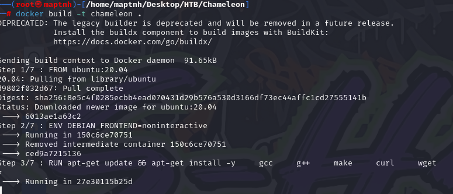
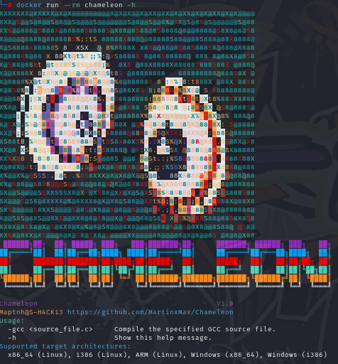
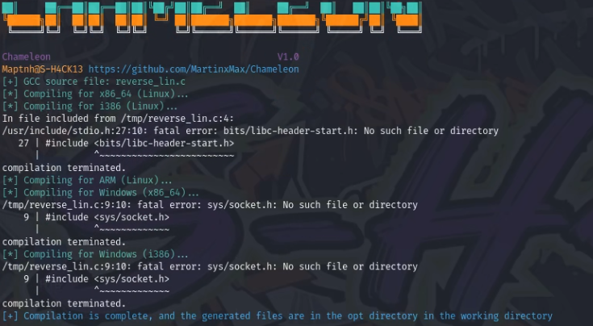
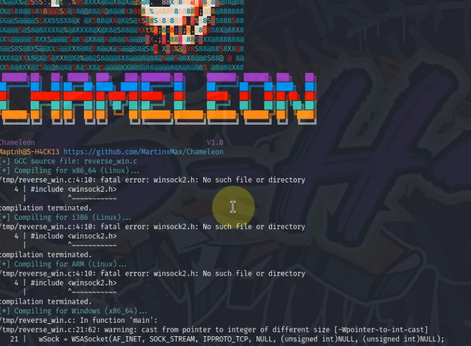
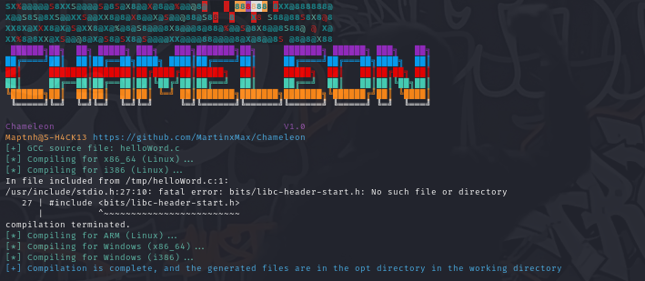
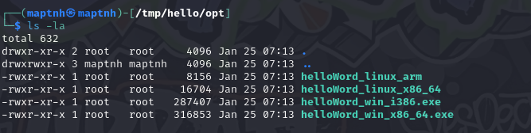
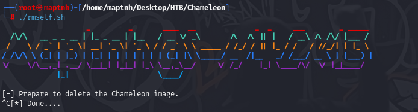

 
# **Chameleon**

## **Login & Proxy Settings**

To set up Docker with a proxy, follow these steps:

1. **Create the configuration directory**:
   ```bash
   sudo mkdir -p /etc/systemd/system/docker.service.d
   sudo touch /etc/systemd/system/docker.service.d/proxy.conf
   ```

2. **Configure proxy settings** by editing the `proxy.conf` file:
   ```bash
   [Service]
   Environment="HTTP_PROXY=http://proxy.example.com:8080/"
   Environment="HTTPS_PROXY=http://proxy.example.com:8080/"
   Environment="NO_PROXY=localhost,127.0.0.1,.example.com"
   ```

3. **Reload the systemd and restart Docker**:
   ```bash
   sudo systemctl daemon-reload
   sudo systemctl restart docker
   ```

4. **Login to Docker**:
   ```bash
   docker login -u <Username>
   ```

   Use your Docker password or access token when prompted.

## **Building**

To build Chameleon, follow these steps:

1. Clone the repository:
   ```bash
   git clone https://github.com/MartinxMax/Tyrant.git
   ```

2. Change to the Chameleon directory:
   ```bash
   cd Chameleon
   ```

3. Build the Docker image:
   ```bash
   docker build -t chameleon .
   ```

   

## **Usage**

To run Chameleon:

```bash
docker run --rm -v <working dir>:/tmp chameleon -gcc <.C File>
```

To get help on the available options:

```bash
docker run --rm chameleon -h
```



## **Reverse Shell for Linux**

To compile a reverse shell for Linux:

```bash
docker run --rm -v /home/maptnh/Desktop/HTB/Chameleon/reverseshell:/tmp chameleon -gcc reverse_lin.c
```

The output will be saved in: `<working dir>/opt`



## **Reverse Shell for Windows**

To compile a reverse shell for Windows:

```bash
docker run --rm -v /home/maptnh/Desktop/HTB/Chameleon/reverseshell:/tmp chameleon -gcc reverse_win.c
```

The output will be saved in: `<working dir>/opt`



## **Other .C Files Cross-compilation**

To compile any other C file, such as a "Hello World" program, use the following:

```bash
docker run --rm -v /tmp/hello:/tmp chameleon -gcc helloWord.c
```

Example `helloWorld.c` file:

```c
#include <stdio.h>

int main() {
    printf("Hello\n");
    return 0;
}
```

The output will be saved in: `<working dir>/opt`






## Delete the image

`# ./rmself.sh`

